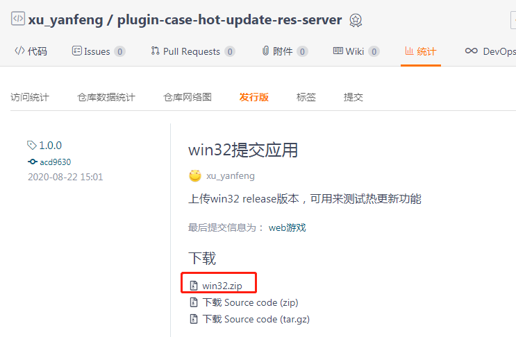
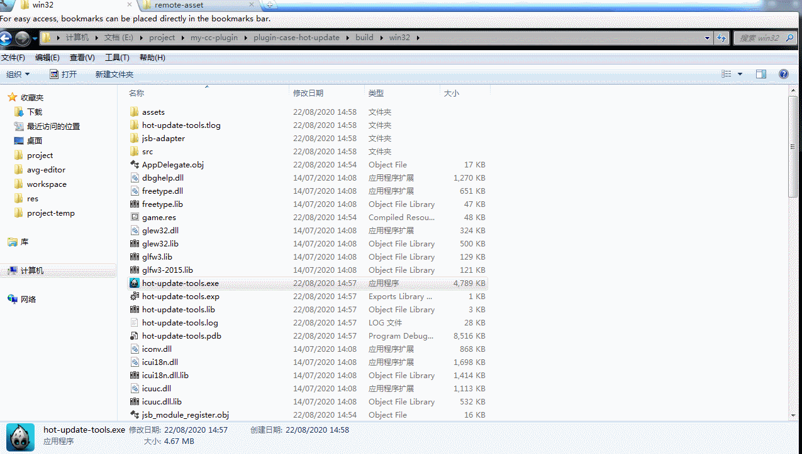

# 热更新工具配套的热更新DEMO

- [热更新插件使用文档](https://tidys.github.io/plugin-docs-oneself/docs/hot-update-tools/)
- [热更新参考游戏脚本逻辑(ts版本)](assets/hot-update/HotUpdate.ts) 

## 热更后的游戏
本DEMO游戏热更后，版本为3.0，[点击预览](http://tidys.gitee.io/plugin-case-hot-update-res-server/web-mobile/)

我把热更资源放在了 [gitee仓库](https://gitee.com/tidys/plugin-case-hot-update-res-server) 的Pages上，
所以热更package url 是 `http://tidys.gitee.io/plugin-case-hot-update-res-server/`

## 热更测试包
我已经编译好了一个可用的EXE游戏DEMO，并放到了Gitee，保证国内下载速度快

你可以在 [Gitee发行版本](https://gitee.com/tidys/plugin-case-hot-update-res-server/releases/1.0.0) 中手动下载自己想要测试的平台包，方便用来测试验证本DEMO的热更新功能。
- [win32.exe](https://files.gitee.com/group1/M00/10/CF/wKgCNF9Awp6ALnIPAhk1n2gTocE199.zip?token=203e5951353022467fbda42b083cff74&ts=1598080968&attname=win32.zip&disposition=attachment) ：直接下载解压后，即可使用 
  
  
  - windows的热更缓存位置`C:\Users\Administrator\AppData\Local\hot-update-tools\remote-asset`

- [android.apk]()：暂无

